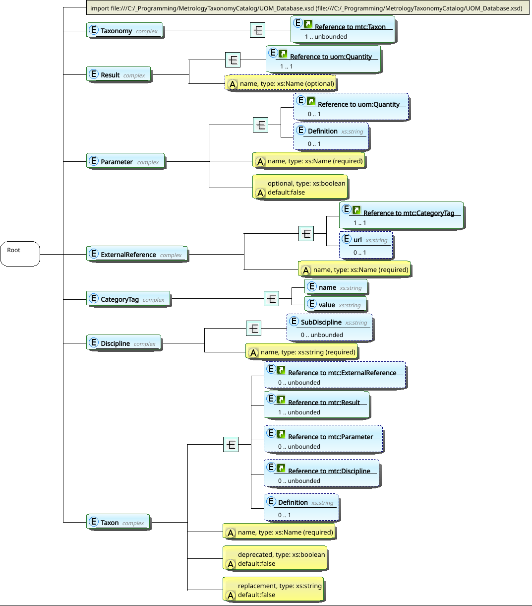

MII Measurand Taxonomy Specification
====================================

Digitalized measurement data should unambiguously identify and describe itself for machine consumption, no matter the content.
Whether the data represents laboratory services (CMCs\ [1]_) in SoAs\ [11]_, functionality in instrument specifications, calibration results in certificates or otherwise, the data should remain interoperable, reusable and machine actionable throughout its life cycle.
The MII Measurand Taxonomy in conjunction with the M-Layer serves as metadata and data to represent the measurands, quantities and units required for this purpose.

The MII measurand conceptualization has three levels.
The highest, most abstract level, provides a schema (https://github.com/NCSLI-MII/measurand-taxonomy/blob/main/MeasurandTaxonomyCatalog.xsd) intended to represent any measurand in any measurement field or discipline.

The second level comprises the MII Measurand Taxonomy catalog of uniquely identified and abstractly qualified measurands.
Each catalog entity uses the abstract schema and assigns the metadata required to uniquely qualify a particular measurand.
Each of these abstractly qualified measurands applies to all concrete measurement data of its type.

Based on the work of the NCSLI 141 MII and Automation Committee, this specification covers the catalog and the model for individual measurands in :ref:`sec:structure` (partially adapted from :cite:p:`CMCDev2`) and will eventually cover the planned modeling extension for concrete measurement data in :ref:`sec:instantiation`.
The approved catalog resides at https://github.com/NCSLI-MII/measurand-taxonomy/blob/main/MeasurandTaxonomyCatalog.xml.

.. _sec:structure:

MII Measurand Structure
-----------------------

Simply stated, the measurand identifies what we intend to measure :cite:p:`VIM3`.
A measurement will fit its purpose to the degree that the measurand specification unambiguously and accurately describes the intent.
Likewise, locating and selecting the correct measuring instrument to perform a measurement or a laboratory with the appropriate CMC to calibrate the instrument depends heavily on measurand specification’s clarity and completeness.
This certainly applies to manual operations aided by human judgment, but becomes all the more critical for unaided machine interpretation.
We first discuss measurand names and then the full measurand schema.

Measurand Name
~~~~~~~~~~~~~~

The measurand name, the measurand’s specific output quantity, matters most for clarity.
Therefore, the MII tags its machine-readable MII measurands with clear, unique, and fully descriptive taxa (metadata) from a defined measurand taxonomy.
Taxa as measurand names apply only to internal document encoding and not to human-readable documents.
The individual MII taxa adhere to the following structure and naming rules:

.. _unique taxon rule:

1. All MII measurement data identify a given measurand by the same unique taxon string.

.. _alias rule:

2. Each taxon may have aliases, such as commonly used equivalents (from *ISO-IEC 80000* :cite:p:`ISO80000`, the KCDB, an AB’s\ [2]_ conventions, non-English languages, etc.).
   These aliases may appear in human-readable documents generated from the digital document as the user prefers.

.. _period rule:

3. Each taxon comprises a series of tokens separated by the period (.) character.

.. _camel rule:

4. Each token uses English words in the UpperCamelCase\ [3]_ naming convention, e.g., ``FrequencyModulation``.
   Note that this convention prohibits spaces and punctuation, including hyphens, in the name.
   Word order within a token (general to specific or vice versa) may vary according to customary usage in the measurement domain: ``LeastSquaresFit`` sounds more natural to practicioners than ``FitLeastSquares``.

.. _process token rule:

5. A taxon’s first token represents the process type, taking either the value ``Measure`` or ``Source`` to identify an input or output measurement process, respectively.\ [4]_

   * A ``Measure`` process takes a physical input and produces an indicated quantity value or nominal property value, whether visual, digital or both.
     ``Measure`` examples include using a meter to indicate the ambient relative humidity, determining a gauge block's length, measuring an attenuator's transmission factor, capturing strain with a sensor.
     ``Measure`` processes include those that use an uncalibrated input device (comparator) and a calibrated source, such as using a resistance bridge to calibrate a resistor against a reference resistor.\ [4]_

   * A ``Source`` process takes a desired quantity value or nominal property value and produces a physical output.
     ``Source`` examples include using a multi-function calibrator to output a nominal voltage to a meter's input terminals, placing a particular mass standard (artifact) on a scale, supplying a pressure to a pressure gauge, exposing a radiometer to black-body radiation.
     ``Source`` processes include those that use an uncalibrated physical source monitored by a calibrated input device such as calibrating a hygrometer with a calibrated chilled-mirror device and a common moist-air source.\ [4]_

.. _quantity next rule:

6. The taxon’s remaining tokens indicate the measured quantity.

.. _qk entry rule:

7. The measured quantity’s first token identifies the quantity kind :cite:p:`VIM3`, which shall unambiguously link to an M-Layer aspect.

.. _quantity hierarchy rule:

8. Any further tokens after the quantity-kind token hierarchically qualify the quantity, proceeding from more general toward more specific quantity descriptors.

.. _acronym rule:

9. The string data format encourages concise tokens and widely recognized acronyms, e.g., ``DC``, ``RF``, ``PRT``, ``CMM``.

.. _no token rule:

10. Add tokens only when required to distinguish measurands with different parameter sets.
    For simulated temperature sources, for example, (``Source.Temperature.Simulated``) we add ``.Thermocouple`` or ``.PRT`` to distinguish thermocouple parameters (e.g., temperature, voltage, type) from PRT parameters (e.g, temperature, resistance, type).
    Rather than adding tokens to create several taxa for different thermocouple types, a nominal-property parameter (e.g., 'ThermocoupleType' = 'T') covers all cases.

.. _special token rule:

11. Special quantity tokens with their own syntax identify common measurement scenarios.

.. _ratio token rule:

   * The `ratio token`_ (``Ratio``) precedes a quantity-kind token to identify a quotient of two like-kind quantities.

.. _coefficient token rule:

   * The `coefficient token`_ (``Coefficient``) precedes two successive and differing quantity-kind tokens to identify a quotient of two unlike quantity kinds.

.. _delta token rule:

   * The `delta token`_ (``Delta``) follows the quantity(ies) to identify a further quantity that differs when measuring the quotient’s numerator and denominator.

.. _model token rule:

   * The `model token`_ (``Model``) after a quantity introduces a standard instrument model.

The `Taxon examples`_ table :cite:p:`MJK:MII4IoT` lists some taxa and their KCDB equivalents that illustrate the MII measurand structure and typical qualifier detail.
Note that the taxon *as a whole* serves as a metadata tag to identify MII measurands.
Other than distinguishing ``Measure`` or ``Source`` processes, a taxon’s syntax and individual tokens do not encode meaning for machine processing; the taxon structure simply facilitates and standardizes taxonomy construction and organization.

.. _Taxon examples:

    .. table:: Taxon examples.

      +------------------------------------------------------+-------------------------------+
      | **MII Taxon**                                        | **Closest KCDB Alias**        |
      +======================================================+===============================+
      | ``Measure.MassDensity.Solid``\ :math:`^{\mathrm{a}}` | Density of solid              |
      |                                                      |                               |
      +------------------------------------------------------+-------------------------------+
      | ``Measure.Pressure.Pneumatic.Absolute.Static``       | Absolute pressure, Gas medium |
      |                                                      |                               |
      +------------------------------------------------------+-------------------------------+
      | ``Source.Current.AC.3Phase``                         | AC Current, Meters            |
      |                                                      |                               |
      +------------------------------------------------------+-------------------------------+
      | ``Source.Mass.Conventional``\ :math:`^{\mathrm{b}}`  | none                          |
      |                                                      |                               |
      +------------------------------------------------------+-------------------------------+

    :math:`^{\mathrm{a}}`\ Mass, as against other densities, e.g., flux; solid v. gas or liquid

    :math:`^{\mathrm{b}}`\ As against (true) mass

Special Tokens
^^^^^^^^^^^^^^

To aid in naming taxa, the MII measurand taxonomy treats two common quantities specially: ratios and coefficients.
The token ``Ratio`` indicates a dimensionless quotient :cite:p:`ISO80000`, such as strain (length per length), amplifier voltage gain (voltage per
voltage), or refraction index (light speed per light speed).
``Coefficient`` on the other hand, indicates a quotient of two different quantities :cite:p:`ISO80000`, such as a transducer calibration correction (voltage per pressure).
A ratio takes the name “factor” when used as a dimensionless proportionality constant :cite:p:`ISO80000`.
In practice, some common measurand names ignore this convention, e.g., “reflection coefficient”, “index of refraction”, both of which we compute as ratios and use as factors.
Both ratios and coefficients play into measurands.

.. _ratio token:

Ratios
''''''

We structure ratio taxa as ``…Ratio.Q``\ [5]_, where ``Q`` names both ratioed quantities.
``Q``\ ’s structure follows the taxon rules: first a token for the quantity kind representing an M-Layer aspect, then successively more specific descriptors.
So, ``Measure.Ratio.Pressure…`` would identify a ratio of two particular pressures (identified in parameters tied to their M-Layer aspect) and ``Source.Ratio.Power.RF…`` would represent a ratio of two microwave powers (likewise identified).

.. _coefficient token:

Coefficients
''''''''''''

Coefficients relate an instrument’s input and output quantities.
Unconditioned piezoelectric accelerometers, for example, output an electric charge that varies with sensed acceleration, a response requiring quantification.
Manufacturers therefore specify a nominal coefficient value that users wish to calibrate in order to correct the transducer output, and so we want a taxon to identify that specification, laboratory’s compatible calibration services and certificates' corresponding measurement results.
The MII measurand structure therefore includes the syntax ``Measure.Coefficient.QIn.QOut…``, where the two quantities listed after ``Coefficient`` correspond to M-Layer aspect entries with the coefficient :math:`c = Q_\mathrm{in}/Q_\mathrm{out}`.
Since ``QIn`` and ``QOut`` respectively correspond to the coefficient's numerator and denominator, we may easily calculate the corrected measured value as :math:`Q_\mathrm{meas} = c * Q_\mathrm{out}`.
Accelerometer sensitivity would look like ``Measure.Coefficient.Acceleration.Charge…``.
When the two quantities require descriptor tokens, the numerator’s descriptor tokens appear directly after the two quantity names, and the denominator’s descriptor tokens thereafter.
So we would name a coefficient of DC voltage to absolute pressure ``Measure.Coefficient.Pressure.Voltage.Absolute.DC``.

Confusion may arise when designating coefficient measurands as ``Measure`` or ``Source``.
A transducer calibration process would *source* an input to the transducer, *measure* the transducer output and calculate the coefficient.
The transducer itself *measures* an input and *sources* an output.
To clarify any confusion, we liken a transducer to any other artifact that embodies and sources a quantity value.
Therefore, the transducer instrument specification would tag the functionality with ``Source`` and a laboratory that calibrates transducers would tag the corresponding CMC with ``Measure``.
We treat any instrument to which a coefficient applies, e.g., a transconductance amplifier, in the same way.

.. _delta token:

Delta
'''''

The two quantities involved in ratios and coefficients often have an influence quantity that differs between them.
For example, we might measure a frequency response by first measuring an signal amplitude :math:`V_\mathrm{ref}` at a reference frequency, then changing the frequency and measuring the new amplitude :math:`V`.
The ratio quantity (:math:`V/V_\mathrm{ref}`) represents the frequency response between the two frequencies.
After the main quantity, the tokens ``…Delta.QInf`` flag an influence quantity ``QInf`` (with a corresponding M-Layer aspect entry) that changes during the measurement.
So using AC amplitudes in this example, we would name their ratio ``Ratio.Voltage.AC.Delta.Frequency``.

.. _model token:

Instrument Models (tentative)
'''''''''''''''''''''''''''''

So far, we’ve discussed ratios and coefficients only in a point-measurement context: calibrating a device at one or more measurement points and determining a *separate* bias-correction coefficient value at each point.
Coefficients also arise in a separate but related context though: the coefficients of a mathematical model (function) that corrects instrument indications *over a range*.
Examples include ITS-90\ [6]_ range and subrange functions for PRTs, quadratic or cubic curve fits for force transducers, Callendar-Van Dusen (CVD) equations for RTDs\ [7]_, and many others.
In theory, we may assign any measuring instrument a correction model and determine the model’s coefficients from measurement results.
Whether done at the calibration-point level or at the range, function, or instrument level, such a correction function with coefficient values raises the service from verification (that the instrument meets tolerances) to true calibration :cite:p:`VIM3`.

Though either the calibrating laboratory or the customer may have software to calculate modeling coefficients from the point-by-point calibration results, the laboratory more likely has the expertise, and for smart instruments, customers may prefer turnkey calibrations that load coefficients into the instrument.
This might drive taxa for identifying such measurement functions, services and results.
The MII tokens ``…Model.M`` serve this purpose, where ``Model`` signals an immediately following defined model type ``M``.
So if an instrument’s specification tagged a measuring function with ``Measure.Temperature.PRT.Model.ITS90``, then ``Source.Temperature.PRT.Model.ITS90`` would identify the CMC to calibrate that function.
In general though, the MII instrument specification schema will provide for calibration models of any form for which calibration services may assign coefficient values for smart instruments and digital calibration certificates :cite:p:`MJK:DataCompleteness`.

Formal Taxon Syntax
^^^^^^^^^^^^^^^^^^^

The following BNF\ [8]_ grammar defines the measurand taxon syntax

+-------------+-----+------------------------------------------------+
| Taxon       | ::= | ProcessType ``.`` (Quantity \| Ratio \|        |
|             |     | Coefficient) [``.`` Model]                     |
+-------------+-----+------------------------------------------------+
| ProcessType | ::= | ``Measure`` \| ``Source``                      |
+-------------+-----+------------------------------------------------+
| Quantity    | ::= | RQK (``.`` Descriptor)\*                       |
+-------------+-----+------------------------------------------------+
| RQK         | ::= | :math:`\langle`\ any name in the quantity kind |
|             |     | registry\ :math:`\rangle`                      |
+-------------+-----+------------------------------------------------+
| Descriptor  | ::= | :math:`\langle`\ any measurand-qualifying      |
|             |     | term\ :math:`\rangle`                          |
+-------------+-----+------------------------------------------------+
| Ratio       | ::= | ``Ratio`` ``.`` Quantity                       |
+-------------+-----+------------------------------------------------+
| Coefficient | ::= | ``Coefficient`` ``.`` RQK\ :sub:`n` ``.``      |
|             |     | RQK\ :sub:`d` (``.`` Descriptor\ :sub:`n`)\*   |
|             |     | (``.`` Descriptor\ :sub:`d`)\*                 |
+-------------+-----+------------------------------------------------+
| Model       | ::= | ``Model`` ``.`` ModelName                      |
+-------------+-----+------------------------------------------------+
| ModelName   | ::= | :math:`\langle`\ any instrument-model          |
|             |     | name\ :math:`\rangle`                          |
+-------------+-----+------------------------------------------------+

where the subscripts “n” and “d” represent numerator and denominator, respectively, and RQK means registered quantity kind (and M-Layer aspect).

Measurand Taxonomy Organization
^^^^^^^^^^^^^^^^^^^^^^^^^^^^^^^

Following the `unique taxon rule`_, each measurand falls logically within a hierarchical measurand taxonomy according to its name (taxon).
Taxa of a similar measurand type have identical tokens to the point of differentiation.
So for example, given a static-pressure measurand named ``…Pressure.Pneumatic.Absolute.Static``, we would name the dynamic-pressure version ``…Pressure.Pneumatic.Absolute.Dynamic``, not ``…Pressure.Pneumatic.Dynamic.Absolute`` (differing order) or ``…Pressure.Air.Absolute.Dynamic`` (arbitrary hierarchy change).
Finally, the ``Source`` and ``Measure`` sub-taxonomies should mirror each other in so far as they contain the same measurands.

Referring back to the `no token rule`_, a single measurand should comprehensively cover all variations that its parameter structure allows; in other words, the taxonomy should not include multiple taxa for special cases of the same measurand.
For example, given a measurand named ``…Voltage.DC``, we should not add another named ``…Voltage.DC.Short`` because the existing measurand has a parameter for the voltage which we may specify as zero to represent a short.
The fact that the measurement process might differ at zero voltage (e.g., physically shorting a connection) has no bearing on the measurand structure.
Less obvious redundancies exist due to differences in conventional nomenclature, so this point bears careful attention.

Supporting Information
~~~~~~~~~~~~~~~~~~~~~~

The measurand name identifies the measurement and disambiguates it from other measurements but does not specify the (critical) capability details.
Here we discuss the further measurand detail required to fully qualify a measurand.

Definition
^^^^^^^^^^

Regardless of care taken in naming measurands, a clear, human-readable definition helps disambiguate one measurand from another.
This helps the metrologist select the correct measurand from a list, for example, when building an SoA.
Also, since new measurands continually arise with new technology or measurement techniques, we will never have a complete measurand taxonomy.
A definition thus helps determine whether the measurand of interest appears in the taxonomy or requires a new entry.
Finally, an extensible taxonomy exposes both its measurands and their definitions to changes reflecting the current state of knowledge.
For example, if we only measured static pressure, then the taxon ``Source.Pressure`` and its definition would require changes to
differentiate ``Pressure.Static`` and ``Pressure.Dynamic`` once a demand for dynamic-pressure measurement arose.

Definitions should manifest as links to external authoritative sources when available.
In many cases, the M-Layer aspect will link to an external source for the quantity or property, but the qualified measurand still requires a specific definition.
Failing that, the measurand should include its own clear definition.

Parameters
^^^^^^^^^^

We devalue calibration without fully knowing and stating the measurement conditions, the measurand’s state.
Specifying the measurand’s full state restricts its *definitional* uncertainty :cite:p:`VIM3`, the range of (true) values that match the measurand; failing to do so may inflate definitional uncertainty beyond other uncertainty components, or even beyond the instrument MPE\ [9]_ specification, essentially making the calibration worthless.
We should define our measurands such that definitional uncertainty remains insignificant relative to other uncertainty components and include those definitions as metadata in instrument specifications, calibration certificates and SoAs.

The measurand state includes the measurand's value, its influence quantities and any applicable instrument operating conditions.
For some measurands, a nominal property such as a waveform type (sine, square, triangle, …) may apply.
Example influence quantities include ambient temperature for relative-humidity measurements, frequency in AC electrical measurements, acceleration in accelerometer sensitivity measurements.
Example instrument operating conditions include the ambient environment (temperature, humidity, pressure, electromagnetic noise, vibration, …), input power quality, external loads.
The MII measurand structure refers to these quantities and properties as “parameters”.
A measurand's parameter values determine the its state, which may affect the measurement or its uncertainty, or limit functionality, and therefore require specification.

The MII measurand structure defines both required and optional parameters.
An automated capability search, a CMC-uncertainty or instrument-MPE calculation and the actual measurement will not all succeed without the required parameter values.
For example, the desired waveform type may eliminate some instruments and laboratories without that capability, or, if the waveform capability exists, it may change the instrument MPE or CMC uncertainty.
Required parameters always include the primary measured (output) quantity.
Optional parameters, however may remain uncontrolled, perhaps invoking a higher uncertainty, or defaulting to a specified (nominal) value.

Taxa in the taxonomy catalog designate parameters as required or optional as seems most appropriate in the abstract case.
When instantiated in concrete measurement data such as a CMC, however, the laboratory will choose which parameters to require, which to make optional with default values such as a 50 :math:`\Omega` input impedance or a 20 °C reference temperature, and which to omit entirely as immaterial to the measurement process.

A complete instrument specification includes the (rated, limiting, and reference) operating conditions :cite:p:`VIM3` for which its specifications apply.
However, a CMC's measurand parameters include instrument operating conditions only when they overlap with laboratory capabilities.
For instance, a customer's voltage reference standard may require battery operation (at a minimum voltage) for specified accuracy, but this instrument detail does not distinguish one laboratory’s capability from another.
In contrast, some rated or reference operating conditions may impose limitations that some laboratories may not achieve, such as a tight ambient-temperature tolerance.
In some cases, the CMC uncertainty would reflect the relevant capability, but not for all instruments.

Input Quantities

Parameters as such do not reflect any particular measurement process or affect the measured value’s calculation.
To decouple measurement techniques from measurands, measurement-process details have no bearing on an abstract MII measurand model.
To define a DC voltage measurand, for example, the parameter structure remains the same whether we use a hand-held meter, a quantum voltage standard or anything else.
*Parameters therefore do not include input quantities*--those quantities that affect the measured (calculated) value and usually the uncertainty according to the particular process's measurement model.

For example, we may measure (calculate) an AC current :math:`I` from a shunt impedance :math:`Z` and a voltmeter indication :math:`V`.
The impedance and voltage serve as input quantities for the measurement model :math:`I = V / Z`, but not as influence quantities included in the measurand's parameters.
However, a parameter or quantity may serve both roles.
For example, if the shunt impedance depends on frequency, then frequency also becomes an input quantity to the measurement model, but not a parameter for that reason.
A instrument's AC current output capability and MPE will depend on frequency though, so frequency constitutes an influence quantity and therefore a required parameter.
As another example, dimensional measurements often use temperature (as an input quantity) to correct for expansion.
Instrument operating conditions or laboratory CMCs may depend on the same temperature, which thus becomes a measurand parameter.

Further Parameter Detail

Parameter names follow the same formatting convention as tokens according to the `camel rule`_.
A given measurand shall not have any duplicate parameter names.
Duplicate names would introduce ambiguity, preventing machines from matching the parameter sets of different instantiated measurands.
The names therefore distinguish parameters of the same quantity or property, e.g., ``InputVoltage`` and ``OutputVoltage``.
Parameter names may vary between measurands, e.g., ``Vin`` and ``Vout``.
Like the measurand itself, each parameter includes a human-readable definition, preferably as a link to an external authoritative source.
Parameter meanings may vary between measurands, so defining the parameter within the context of the given measurand helps ensure clarity.
Parameters with different names may reference the same quantity or aspect, further clarifying the name.

Deprecation
^^^^^^^^^^^

We will occasionally find a measurand whose structure or taxon does not serve its intended purpose.
In such cases we add a taxon or multiple taxa with the correct name and structure.
To achieve backward and forward compatibility, we never delete a measurand from the taxonomy, but instead mark it deprecated and point to its replacement measurand.
This way, older digital documents that incorporated a now-deprecated measurand remain valid and useful, and digital systems may avoid incorporating deprecated measurands in future documents.

Schema
~~~~~~

To complete the picture, the figure depicts the current MII taxonomy schema.
In addition to the elements previously discussed, the schema includes data elements to optionally map MII taxa to other nomenclature systems for human-readable output and interoperability
The schema also allows mapping to other quantity-unit systems, but requires the M-Layer as its primary system due to its comprehesive modeling approach.

.. _sec:instantiation:

Instantiated Measurands
-----------------------

The abstract model covered in Section :ref:`sec:structure` applies to all measurands.
Each individual abstract measurand applies to all measurands of its type.
The model captures all the required metadata but not any actual measurement data.
This section describes the MII model extensions for representing concrete measurement data.

Measuring Intervals
~~~~~~~~~~~~~~~~~~~

The abstract measurand taxa in the taxonomy apply to any measured value, so the taxonomy’s abstract measurands themselves do not include measuring intervals (ranges :cite:p:`VIM3` or nominal values).
Concrete instances such as CMCs, however, should specify the measuring intervals over which they apply.
The MII SoA structure :cite:p:`DZ:SoAUpdate` includes this element, which human-readable documents should show with every concrete measurand\ [10]_.
Besides their contribution to uncertainties and MPEs, this allows intelligent searches for useful calibration services and instrument functions, whether a quantity at a single point or an entire instrument range interests us.
This logic applies to not only the output quantity, but also all the parameters.
Customers may choose to omit optional parameter values for CMC searches or calibration requests, but SoA CMCs should define ranges, if only single points, for all supported parameters.
As with parameter defaults, all ranges represent nominal values in CMCs and instrument specifications; measured values appear only in calibration certificates.

Uncertainty
~~~~~~~~~~~

The abstract measurand model contains no uncertainty information.
Any instantiated measurand, will however, contain that information, even if stated as an MPE.
The uncertainty element takes the form of TBD…

Measurement Data Types
~~~~~~~~~~~~~~~~~~~~~~
Customers expect measurement data in various forms: nominal value, reference value, measured value, deviation, error, as well as several statistics, depending on the context.
The MII model for instantiated measurands includes all such information, identified as follows: (TBD)

.. _sec:notes:

Notes
-----

.. [1]
   calibration and measurement capabilities

.. [2]
   accreditation body

.. [3]
   also known as Pascal or Capitalized

.. [4]
   Regardless of whether the measurement process uses a direct, common-source, or comparator measurement method :cite:p:`NCSLI:RP12`.
   A token to capture both Source and Measure may seem useful, but source and measure uncertainties usually if not always differ and therefore require separate CMCs, instrument specifications and calibration results.

.. [5]
   used for both ratios and factors since both require only one quantity kind

.. [6]
   International Temperature Scale, 1990

.. [7]
   resistance temperature detectors (or devices)

.. [8]
   Backus-Naur form: “\|” separates alternatives, “\*” means zero or more consecutive instances, angle brackets enclose descriptive text,
   parentheses group tokens

.. [9]
   maximum permissible error

.. [10]
   Caveat: Measuring intervals may not apply to data outside the calibration field.

.. [11]
   statement of accreditation
